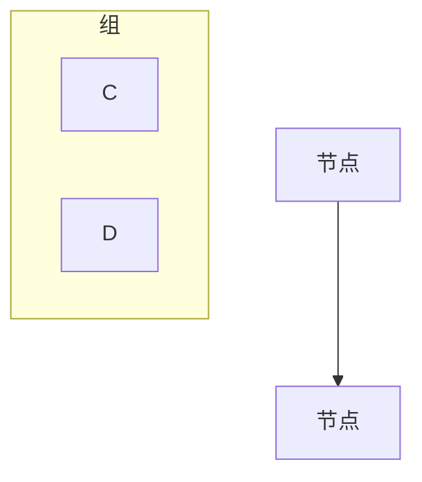
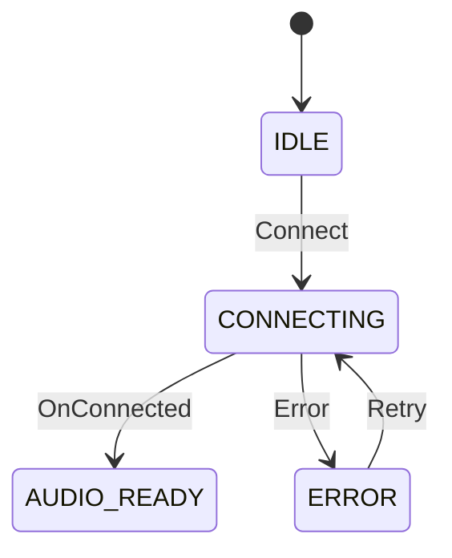

# AGENTS.md

Behavioral guidelines to reduce common LLM coding mistakes. Merge with project-specific instructions as needed.

**Tradeoff:** These guidelines bias toward caution over speed. For trivial tasks, use judgment.

## 优先级顺序（冲突时）

1. **安全优先** — 危险操作（删除/覆盖/破坏性修改）必须确认
2. **用户意图** — 不清晰时优先提问，而非猜测
3. **Simplicity** — 在确认范围内保持最小化
4. **Surgical** — 仅修改直接相关的代码

## 问题类型分类

| 类型 | 示例 | 行动 |
|------|------|------|
| 简单指令 | "编译"、"运行"、"查看文件" | 直接执行 |
| 模糊指令 | "优化"、"改进"、"添加功能" | 先问清楚目标和范围 |
| 高风险操作 | 删除文件、修改配置、覆盖代码 | 确认操作和影响后再执行 |

---

## 1. Think Before Coding

**Don't assume. Don't hide confusion. Surface tradeoffs.**

Before implementing:
- State your assumptions explicitly. If uncertain, ask.
- If multiple interpretations exist, present them - don't pick silently.
- If a simpler approach exists, say so. Push back when warranted.
- If something is unclear, stop. Name what's confusing. Ask.

**分类行动**:
- 简单指令 → 直接执行
- 模糊指令 → 先澄清："你说的X是指...？"
- 高风险操作 →明确说出风险："这会删除Y，确认吗？"

---

## 2. Simplicity First

**Minimum code that solves the problem. Nothing speculative.**

- No features beyond what was asked.
- No abstractions for single-use code.
- No "flexibility" or "configurability" that wasn't requested.
- No error handling for impossible scenarios.
- If you write 200 lines and it could be 50, rewrite it.

Ask yourself: "Would a senior engineer say this is overcomplicated?" If yes, simplify.

---

## 3. Surgical Changes

**Touch only what you must. Clean up only your own mess.**

When editing existing code:
- Don't "improve" adjacent code, comments, or formatting.
- Don't refactor things that aren't broken.
- Match existing style, even if you'd do it differently.
- If you notice unrelated dead code, mention it - don't delete it.

When your changes create orphans:
- Remove imports/variables/functions that YOUR changes made unused.
- Don't remove pre-existing dead code unless asked.

**边界判断**: 每行修改是否直接trace到用户请求？是 → 可以改；否 → 别改。

---

## 4. Goal-Driven Execution

**Define success criteria. Loop until verified.**

Transform tasks into verifiable goals:
- "Add validation" → "Write tests for invalid inputs, then make them pass"
- "Fix the bug" → "Write a test that reproduces it, then make it pass"
- "Refactor X" → "Ensure tests pass before and after"

For multi-step tasks, state a brief plan:
```
1. [Step] → verify: [check]
2. [Step] → verify: [check]
3. [Step] → verify: [check]
```

Strong success criteria let you loop independently. Weak criteria ("make it work") require constant clarification.

---

## 高风险操作确认清单

执行以下操作前必须确认：
- [ ] 删除文件或清空目录
- [ ] 覆盖已有的配置文件
- [ ] 修改其他用户的代码
- [ ] 执行破坏性命令（`rm -rf`、`git push --force`等）
- [ ] 更改系统设置或权限

---

---

## Obsidian 文档制作规范

**适用范围**: 所有写入 Obsidian Vault 的 Markdown 文档

制作任何 MD 文档前，**必须**确认符合以下规范。

### 一、文件命名规范

| 规范 | 正确示例 | 错误示例 |
|------|----------|----------|
| 使用中文 | `01_架构总览.md` | `01_architecture_overview.md` |
| 使用下划线分隔 | `03-1_boards开发板框架.md` | `03-1 boards开发板框架.md` |
| 序号与标题组合 | `02-1_audio声频模块.md` | `audio.md` |
| 避免特殊字符 | `MCP协议服务.md` | `MCP@协议服务.md` |

### 二、表格格式规范

**分隔线必须使用标准格式（每列至少3个横杠）**:

```markdown
| 列1 | 列2 | 列3 |
|------|------|------|
| 内容 | 内容 | 内容 |
```

❌ **错误格式**:
```markdown
| 列1 | 列2 | 列3 |
|---|------|---|      ← 只有1个横杠
|------|------|------|   ← 超过6个横杠
```

### 三、目录结构规范

```
项目目录/
├── 01_需求文档/
├── 02_设计文档/
├── 03_开发文档/
│   ├── _代码归档/      ← 代码分析文档（_前缀表示内部资料）
│   ├── _环境配置/      ← 环境搭建文档
│   ├── _日志/          ← 开发日志
│   └── _进度计划/      ← 进度跟踪
├── 04_测试文档/
├── 05_部署运维/
└── 06_复盘总结/
```

### 四、文档头部规范

每个文档必须包含：

```markdown
# 文档标题

> 📂 路径：相对路径/文档名.md
> 📍 源码：对应源码路径（可选）

---

## 章节标题

正文内容...
```

### 五、链接规范

| 链接类型 | 格式 | 示例 |
|----------|------|------|
| 内部链接（OB双链） | `[[文档名]]` | `[[01_架构总览]]` |
| 内部链接（带标题） | `[[文档名#标题]]` | `[[02-1_audio声频模块#三、核心类]]` |
| 外部链接 | `[文字](URL)` | `[ESP-IDF](https://docs.espressif.com/)` |

### 六、代码块规范

```markdown
```cpp
// 语言标识必须准确
void example() {
    // 代码内容
}
```
```

常用语言标识: `cpp`, `c`, `python`, `bash`, `json`, `markdown`, `mermaid`

### 七、Mermaid 图表规范

```markdown

```

推荐使用: `graph`, `classDiagram`, `sequenceDiagram`, `flowchart`, `stateDiagram-v2`

### 八、禁止的 ASCII 字符模式

| 字符 | 含义 | 替代方案 |
|------|------|---------|
| `┌ ┬ ┴ ┼` | 框线交叉 | Mermaid graph |
| `└ ┐ ┘ ├ ┤` | 框线端点 | Mermaid graph |
| `│` | 框线竖 | Mermaid graph |
| `──` `↓` `→` `←` `↑` | 箭头/流程线 | Mermaid stateDiagram/flowchart |
| `┌──────────────────┐` | ASCII 架构图 | Mermaid graph |
| `├──────────────────┤` | ASCII 分隔线 | Markdown 表格 |

### 九、Mermaid 图表规范

**常用图表类型**:

| 用途 | 图表类型 | 示例 |
|------|---------|------|
| 系统架构 | `graph TB/LR` | `A[节点] --> B[节点]` |
| 类继承 | `classDiagram` | `class Foo --> Bar` |
| 交互流程 | `sequenceDiagram` | `A->>B: message` |
| 状态机 | `stateDiagram-v2` | `[*] --> A` |
| 流程图 | `flowchart LR/TB` | `A --> B` |

**嵌套节点处理**:

❌ **错误** - 方括号内嵌套方括号:
```markdown
Tools[McpTool[]<br/>工具列表]
```

✅ **正确** - 用引号包裹:
```markdown
Tools["McpTool 列表<br/>tools_"]
```

**状态流转示例**:



### 十、检查清单

写入 OB 前逐项确认：

- [ ] 文件名符合命名规范（中文、下划线分隔）
- [ ] 包含文档头部（路径、源码链接）
- [ ] 表格使用 `|------|------|------|` 分隔线（每列至少 6 个横杠）
- [ ] 代码块标注正确语言（`cpp`/`bash`/`json`/`mermaid`）
- [ ] 内部使用 `[[双链]]` 格式
- [ ] 无 ASCII 架构图（┌└│├┤┬┴┼↓→←↑）
- [ ] 架构图使用 Mermaid 格式
- [ ] 路径引用使用相对路径
- [ ] 嵌套节点用引号包裹 `"text with [brackets]"`

---

**These guidelines are working if:** fewer unnecessary changes in diffs, fewer rewrites due to overcomplication, and clarifying questions come before implementation rather than after mistakes.

---

## 関連ドキュメント (Obsidian Vault)

開発ログ・既知の問題・教訓は [[docs/_ログ/]] 配下にあります:

- [[docs/_ログ/2026-06-15_v0.3.1開発ログ]] — 時系列の開発記録
- [[docs/_ログ/2026-06-15_v0.3.1バグログ]] — 個別バグの詳細と修正
- [[docs/_ログ/2026-06-15_既知の問題と回避策]] — 未解決問題と回避方法
- [[docs/_ログ/2026-06-15_教訓と学び]] — 次サイクル以降の教訓

| ファイル | 役割 | 行数 |
|---|---|---|
| 2026-06-15_v0.3.1開発ログ.md | 開発の時系列記録 | 135 |
| 2026-06-15_v0.3.1バグログ.md | 9 件のバグ詳細 | 295 |
| 2026-06-15_既知の問題と回避策.md | 8 件の未解決問題 | 144 |
| 2026-06-15_教訓と学び.md | 9 件の教訓 | 127 |

### ログディレクトリ命名規則

- **場所**: `docs/_ログ/`
- **ファイル名**: `YYYY-MM-DD_タイトル.md` (アンダースコア区切り)
- **言語**: 日本語 (プロジェクト規約に準拠)
- **相互リンク**: Obsidian `[[ダブルチェーン]]` 形式を使用
- **プレフィックス**: `_` (アンダーバー) は「内部資料」を示す

### 既存ドキュメントとの対応

| 種別 | 場所 | 内容 |
|---|---|---|
| 機能仕様 | `docs/TEST_PLAN_v0.3.1.md` | v0.3.1 全機能テスト計画 |
| コードレビュー | `docs/CODE_REVIEW.md` | 過去サイクルのレビュー結果 |
| 録音保存仕様 | `docs/2026-06-14_录音保存路径改造.md` | 録音ファイル保存パス変更 |
| 手動テスト | `docs/MANUAL_TEST_CHECKLIST.md` | QA 向け手動テスト手順 |
