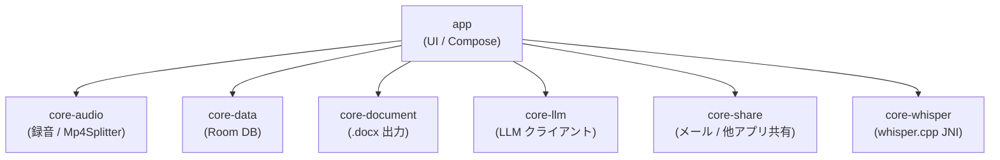
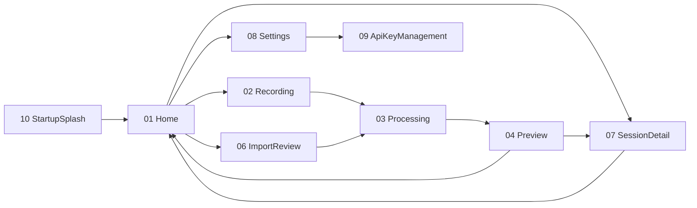

# GijiMemo (議事録メモ / Meeting Minutes Memo)

> 🎙️ **录音即纪要** · Recording → LLM Transcription → Markdown → Email/Share
>
> Android 端会議録自動生成アプリ · 録音から共有までをワンストップで

[](https://github.com/superlambkin/GIMI-MEMO/releases/latest)
[](LICENSE)
[](https://developer.android.com/about/versions/oreo)
[](https://github.com/superlambkin/GIMI-MEMO)

[English](#english) | [中文](#中文) | [日本語](#日本語)

---

## 🎯 项目愿景

**「省掉会后整理录音的 30-60 分钟，实现"开会时录音 → 结束即有结构化会议纪要 → 一键邮件/聊天分享"」**

| 维度 | 现状 | GijiMemo 后 |
|:----|:-----|:-----------|
| 会后整理时间 | 30-60 min | **< 5 min** |
| 纪要格式 | 散乱笔记 / Word | **结构化 Markdown + Word + TXT** |
| 多场景适配 | 录音笔 + 转写员 | **单 App 全流程** |
| 隐私 | 云端 ASR 上传 | **端侧 Whisper 优先** |
| 中文会议质量 | 一般 | **DeepSeek / MiniMax 国内优化** |
| 多 LLM 切换 | 锁死单一 Provider | **6 Provider 一键切换** |

---

## ✨ 核心功能 (v0.9.2)

### 🎙️ 录音功能
- **MediaRecorder AAC + LAME MP3** 両対応
- **リアルタイム波形ビジュアライザ** (振幅感度 300 倍)
- **录音強化 4 段階**: NoiseSuppressor (NS) + AGC + VOICE_COMMUNICATION + VAD
- **サンプリングレート / ビットレート** を設定画面で個別選択
- **保存時ファイル名編集** (録音開始時刻ベース初期値)

### 🤖 AI 推理 (3 値化)
- **クラウド**: 6 種 LLM Provider (OpenAI / Claude / DeepSeek / MiniMax 国内/海外 / Ollama)
- **ローカルスマホ**: Whisper.cpp 端側 + 5 種モデル選択 (tiny Q5_1 31MB 〜 medium)
- **ローカル PC**: ローカルネットワーク上の Whisper サーバ (POST `/asr` multipart, 25MB 制限なし)
- **MULTIMODAL + WHISPER_THEN_SUMMARY** モード切替
- **9 種要約テンプレート** (議事録 / 授業 / DR / 取材 / 雑談 / メディア / カスタム 1/2/3)

### 📄 出力形式
- **Word (.docx) + Markdown + TXT** 三形式
- **複数 MP3 一括文字起こし + 時系列結合** (個別セッション + 結合セッション)
- **長尺音声チャンク文字起こし** (指数バックオフリトライ・部分失敗警告)

### 📤 共有 (v0.9.2 新機能)
- **メール共有**: 添付ファイル MIME 不一致修正済 (`attachmentMime */*`)
- **他アプリ共有**: Android `ACTION_SEND` chooser で WeChat / LINE / Slack / Teams 等に転送
- **Word 出力から `**` (アスタリスク) 除去** (チャット可読性)

### 🔊 TTS
- **多 TTS エンジン自動検出** + Fallback 機構
- **Huawei TTS / Google TTS / システム TTS** 対応
- **語速/音調独立制御** (0.5x - 2.0x)

### 💾 履歴・設定
- **Room ローカルストレージ** + 詳細画面 + 削除
- **Provider / API Key / モデル / 呼出モード / テーマ / TTS** 詳細設定
- **外部 MP3 / TXT インポート** (SAF Storage Access Framework)
- **失敗/停止済みデータ一括削除**

---

## 📸 スクリーンショット

| 画面 | 状態 | ファイル |
|:----|:----|:--------|
| Home (履歴一覧) | Idle | [[04_测试文档/screenshots/v0.7.0/01_home_actual.png]] |
| Settings (7 大区画) | Idle | [[04_测试文档/screenshots/v0.7.0/02_settings_actual.png]] |
| ApiKey Management | MiniMax 接続済 | [[04_测试文档/screenshots/v0.7.0/03_apikey_actual.png]] |
| Recording (待機) | Idle | [[04_测试文档/screenshots/v0.7.0/04_recording_idle_actual.png]] |
| Recording (録音中) | 波形動作中 | [[04_测试文档/screenshots/v0.7.0/04_recording_active_actual.png]] |
| Processing | TRANSCRIBED 完了 | [[04_测试文档/screenshots/v0.7.0/05_processing_actual.png]] |
| Session Detail | 要約表示 | [[04_测试文档/screenshots/v0.7.0/06_session_detail_actual.png]] |
| Share Chooser | Gmail 選択時 | [[04_测试文档/screenshots/v0.7.0/07_share_chooser_actual.png]] |

> 📸 撮影: Xiaomi Mi Note 10 Pro (Android 11, 1080×2340) · 2026-06-21 · v0.7.0 APK
> 📦 v0.9.2 スクリーンショットは次期リリースで追加予定

---

## 📦 インストール

### 📋 動作要件

| 項目 | 最低 | 推奨 |
|:----|:----|:----|
| Android | 8.0 (API 26) | 14 (API 34) |
| メモリ | 2 GB | 4 GB+ |
| ストレージ | 200 MB | 1 GB+ |
| マイク | ✅ | ✅ |
| JDK (ビルド時) | — | **JDK 21** |

### 🚀 APK インストール

1. [Releases](https://github.com/superlambkin/GIMI-MEMO/releases) ページから最新 APK をダウンロード
   - **v0.9.2**: [GijiMemo-v0.9.2-debug.apk](https://github.com/superlambkin/GIMI-MEMO/releases/tag/v0.9.2) (65.8 MB)
   - **v0.9.1**: [GijiMemo-v0.9.1-debug.apk](https://github.com/superlambkin/GIMI-MEMO/releases/tag/v0.9.1) (65.7 MB)
2. デバイスにインストール:
   ```bash
   adb install -r GijiMemo-v0.9.2-debug.apk
   ```
3. アプリ起動 → 設定画面で LLM Provider / API Key を構成
4. マイク権限を許可して録音開始

> ⚠️ debug 鍵署名のため Play Store 公開は不可、サイドロード用公開として位置づけ

---

## 🏗️ アーキテクチャ

### 7 Gradle モジュール



### 9 画面遷移



---

## 🛠️ ビルド

### 必要環境

- **JDK 21** (Eclipse Temurin / Adoptium 推奨)
- **Android SDK** (API 26-34)
- **Gradle 8.5+** (Gradle Wrapper 同梱)

### ビルドコマンド

```bash
git clone https://github.com/superlambkin/GIMI-MEMO.git
cd GIMI-MEMO
# JDK 21 を指定 (Windows)
set JAVA_HOME=C:\Program Files\Eclipse Adoptium\jdk-21.0.12.101-hotspot
# macOS / Linux
export JAVA_HOME=/path/to/jdk-21

gradlew assembleDebug
# APK: app/build/outputs/apk/debug/app-debug.apk
```

### テスト実行

```bash
gradlew test
```

---

## 📊 バージョン履歴

| バージョン | リリース日 | 主要機能 |
|:---------|:---------|:--------|
| **v0.9.2** | 2026-09-05 | 他アプリ共有ボタン・音声時間表示・transcribe タイマー修正 |
| **v0.9.1** | 2026-08-22 | ネットワーク Whisper（ローカル PC）対応・メール添付 TXT 修正 |
| v0.9.0 | 2026-08-21 | 長尺音声チャンク改善・複数 MP3 一括文字起こし・共有受け取り |
| v0.8.1 | 2026-07-04 | 文字起こし画面にキャンセルボタン |
| v0.8.0 | 2026-06-24 | 振幅感度 300 倍・スレッド 4 安定化・Whisper モデル設定反映 |
| v0.7.8 | 2026-06-23 | ストリーミング文字起こし中止・コードクリーンアップ |
| v0.7.6 | 2026-06-22 | 高速化（Silero VAD・チャンク並列処理） |
| v0.7.0 | 2026-06-21 | 録音強化（NS/AGC/VAD）+ TTS 多エンジン + 9 種テンプレート |

詳細: [Releases ページ](https://github.com/superlambkin/GIMI-MEMO/releases)

---

## 🐛 既知の問題

詳細は [[https://github.com/superlambkin/GIMI-MEMO/blob/master/.release-notes/]] および Issues 参照。

主な既知問題:
- 部分 OEM (MIUI / ColorOS) で通話録音に Root が必要
- 1GB 超の録音ファイルで OOM 可能性 (v0.9.0 チャンク処理で改善)
- 一部 LLM (DeepSeek / Ollama) で中文要約に誤字

---

## 🤝 コントリビュート

Pull Requests / Issues 歓迎です。
開発ログ・設計書は [docs/](docs/) ディレクトリおよびリポジトリ内の `.release-notes/` を参照してください。

### 開発フロー

1. `master` から feature ブランチ作成 (`feature/<機能名>`)
2. 変更実装 + テスト追加
3. ローカルで `gradlew test` + `gradlew assembleDebug` 確認
4. PR 作成 (タイトルに `feat(v0.X.Y):` / `fix:` / `docs:` 等の prefix)
5. CI 通過 + レビュー後マージ

### コミットメッセージ規約

```
feat(v0.9.2): 新機能の説明
fix(v0.9.2): バグ修正の説明
docs: ドキュメント更新
chore: ビルド・設定変更
refactor: コード整理
```

---

## 📄 ライセンス

[License TBD] - 詳細は LICENSE ファイル参照 (準備中)

---

## 🙏 謝辞

- 🤖 [MiniMax-M3](https://www.example.com/) 团队提供的 LLM 支持
- 🎙️ [whisper.cpp](https://github.com/ggerganov/whisper.cpp) 开源社区
- 🎨 [Material 3](https://m3.material.io/) 设计团队
- 🐕 MiuMiu 🐾 - AI アシスタント (本 README を含む開発支援)

---

## 🔗 リンク

- 📦 [GitHub Releases](https://github.com/superlambkin/GIMI-MEMO/releases)
- 🐛 [Issues](https://github.com/superlambkin/GIMI-MEMO/issues)
- 💬 [Discussions](https://github.com/superlambkin/GIMI-MEMO/discussions)
- 📋 [CHANGELOG](https://github.com/superlambkin/GIMI-MEMO/blob/master/CHANGELOG.md) (Vault 内 SSOT)

---

# English

GijiMemo (議事録メモ / Meeting Minutes Memo) is an Android app that automates meeting minutes generation. Record audio during meetings, automatically transcribe with on-device Whisper or cloud LLM, generate structured summaries in Markdown/Word/TXT, and share via email or chat apps.

## Quick Start

1. Download the latest APK from [Releases](https://github.com/superlambkin/GIMI-MEMO/releases)
2. Install via `adb install -r GijiMemo-v0.9.2-debug.apk`
3. Configure your LLM provider (OpenAI / Claude / DeepSeek / MiniMax / Ollama) in Settings
4. Grant microphone permission and start recording

## Features

- **3 transcription modes**: Cloud LLM / On-device Whisper / Local PC Whisper server
- **6 LLM providers** with one-click switching
- **9 summary templates** (meeting / lecture / design review / interview / chat / media / custom)
- **Multi-format export**: Word (.docx) / Markdown / TXT
- **Multi-app sharing**: Email / WeChat / LINE / Slack / Teams via Android share sheet (v0.9.2)
- **Audio enhancement**: NS / AGC / VAD with individual ON/OFF toggles
- **TTS playback** with multi-engine fallback (Huawei / Google / System)

See [Releases](https://github.com/superlambkin/GIMI-MEMO/releases) for full version history.

---

# 中文

GijiMemo (議事録メモ / 会议纪要) 是一款 Android 端会议纪要自动生成应用。开会时录音,通过端侧 Whisper 或云端 LLM 自动转写,生成结构化 Markdown/Word/TXT 纪要,并通过邮件或聊天应用分享。

## 快速开始

1. 从 [Releases](https://github.com/superlambkin/GIMI-MEMO/releases) 下载最新 APK
2. 通过 `adb install -r GijiMemo-v0.9.2-debug.apk` 安装
3. 在设置中配置 LLM Provider (OpenAI / Claude / DeepSeek / MiniMax / Ollama)
4. 授予麦克风权限开始录音

## 核心功能

- **3 种转写方式**: 云端 LLM / 端侧 Whisper / 本地 PC Whisper 服务器
- **6 家 LLM 提供商** 一键切换
- **9 种摘要模板** (会议 / 课堂 / 设计评审 / 采访 / 闲聊 / 媒体 / 自定义)
- **多格式导出**: Word (.docx) / Markdown / TXT
- **多应用分享**: 邮件 / 微信 / LINE / Slack / Teams (v0.9.2)
- **录音增强**: NS / AGC / VAD 可独立开关
- **TTS 朗读** 多引擎 Fallback (华为 / Google / 系统)

完整版本历史请参阅 [Releases](https://github.com/superlambkin/GIMI-MEMO/releases)。

---

# 日本語

GijiMemo (議事録メモ) は Android 向けの会議録自動生成アプリです。会議中の録音 → 端側 Whisper / クラウド LLM による文字起こし → Markdown / Word / TXT 形式での構造化要約生成 → メール / チャットアプリ共有までをワンストップで提供します。

## クイックスタート

1. [Releases](https://github.com/superlambkin/GIMI-MEMO/releases) から最新 APK をダウンロード
2. `adb install -r GijiMemo-v0.9.2-debug.apk` でインストール
3. 設定画面で LLM Provider (OpenAI / Claude / DeepSeek / MiniMax / Ollama) を構成
4. マイク権限を許可して録音開始

## 主な機能

- **3 つの文字起こし方式**: クラウド LLM / 端末内 Whisper / ローカル PC Whisper サーバ
- **6 社の LLM プロバイダー** をワンクリック切替
- **9 種類の要約テンプレート** (議事録 / 授業 / DR / 取材 / 雑談 / メディア / カスタム)
- **マルチフォーマット出力**: Word (.docx) / Markdown / TXT
- **マルチアプリ共有**: メール / WeChat / LINE / Slack / Teams (v0.9.2)
- **録音強化**: NS / AGC / VAD を個別 ON/OFF
- **TTS 読み上げ** マルチエンジン Fallback (Huawei / Google / System)

バージョン履歴の詳細は [Releases](https://github.com/superlambkin/GIMI-MEMO/releases) を参照。

---

*📋 GijiMemo v0.9.2 · Last updated 2026-09-05 · MiuMiu 🐾*
