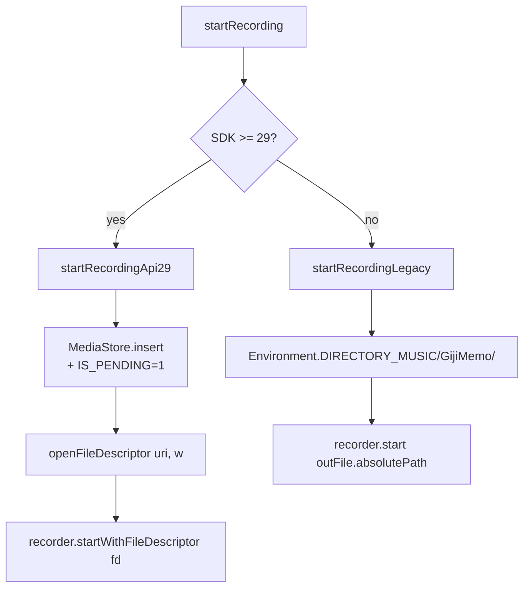
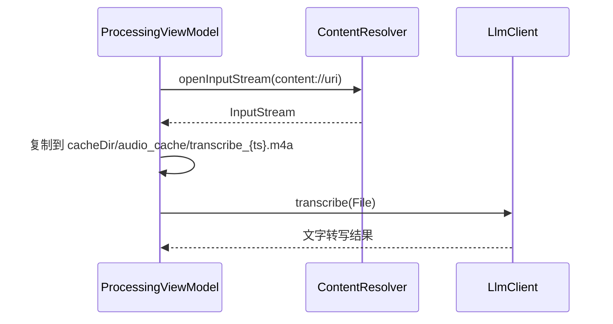

# 录音保存路径改造（MediaStore + Scoped Storage）

> 📂 路径：docs/2026-06-14_录音保存路径改造.md
> 📍 源码：app/src/main/java/com/gijimemo/ui/recording/RecordingViewModel.kt
> 📅 日期：2026-06-14
> 👤 需求提出：用户
> 🐶 实施：MiuMiu (Claude)

---

## 一、背景与目标

### 旧实现（v0.2.0 及之前）
- 录音文件写入 App 私有目录 `context.filesDir/recordings/{sessionId}.m4a`
- 文件对用户**不可见**，卸载 App 后即丢失
- 备份/分享/管理需要专门走 App 内部 UI

### 新实现（v0.2.1+）
- 录音文件保存到**公共音乐目录** `Music/GijiMemo/`
- 用户在系统 **Files / Files Go / 任何文件管理器** 中都能看到
- 支持系统分享、备份、媒体播放器直接播放
- 格式保持 AAC-in-MP4（容器 `.m4a`），与原项目录音格式一致

---

## 二、存储位置与 API 兼容

| Android 版本 | API 等级 | 存储机制 | 是否需要运行时权限 |
|---|---|---|---|
| 11.0+ | API 30+ | MediaStore + Scoped Storage | ❌（ContentResolver 写入） |
| 10.0 | API 29 | MediaStore + Scoped Storage | ❌ |
| 9.0 及以下 | API ≤ 28 | `Environment.getExternalStoragePublicDirectory` | ✅ `WRITE_EXTERNAL_STORAGE`（带 `maxSdkVersion=28`） |

> 决策依据：API 29 起 Scoped Storage 强制，App 不能随意写公共目录。MediaStore 是系统推荐路径。

---

## 三、最终保存路径

```text
/sdcard/Music/GijiMemo/{sessionId}.m4a
```

录音中的临时状态（API 29+）：
```text
/sdcard/Music/GijiMemo/.pending-{sessionId}.m4a
```

→ 录音结束、`IS_PENDING=0` 后，文件对其他 App 可见（媒体扫描器、文件管理器）。

---

## 四、核心代码改动

### 4.1 录音位置标识语义变更

`[[Session]]#audioFilePath` 字段的语义在 v0.2.1 改为 **位置标识字符串**：

| Android 版本 | 标识内容 | 形态 |
|---|---|---|
| API 29+ | MediaStore content URI | `content://media/external/audio/media/{id}` |
| API ≤ 28 | 公共目录绝对路径 | `/storage/emulated/0/Music/GijiMemo/{sessionId}.m4a` |

读取方（播放、转写、详情、删除）需根据前缀 `content://` / `file://` / 纯路径 分别处理。

### 4.2 `AudioRecorder` 接口扩展

`[[AudioRecorder]]` 新增方法：

```kotlin
suspend fun startWithFileDescriptor(outputFd: FileDescriptor)
```

- 旧 `start(outputPath: String)` 保留，用于 App 私有目录场景
- 新 `startWithFileDescriptor` 接受 `FileDescriptor`，适配 MediaStore `openFileDescriptor(uri, "w")`
- `stop()` 签名改为 `suspend fun stop()`（**不再返回路径**）—— 位置标识由调用方维护

### 4.3 `RecordingViewModel` 双路径启动



### 4.4 Pending 状态管理

录音期间 PFD 保持打开以独占写入：

```kotlin
private var pendingPfd: ParcelFileDescriptor? = null
private var pendingUri: Uri? = null
```

`stopRecording` → `finalizeAudioLocation`：
1. `resolver.update(uri, {IS_PENDING: 0}, ...)` → 公开文件
2. `pendingPfd.close()` → 释放内核句柄
3. 返回 URI 字符串存入 `Session.audioFilePath`

### 4.5 播放兼容

`startPlayback()` 根据前缀分支：

```kotlin
if (location.startsWith("content://") || location.startsWith("file://")) {
    setDataSource(context, Uri.parse(location))
} else {
    setDataSource(location)  // 旧数据兼容
}
```

### 4.6 转写流式读取

`ProcessingViewModel.resolveAudioFile()` 接收 URI → 复制到 `cacheDir/audio_cache/` 临时文件，再交给 LLM 客户端：



---

## 五、权限

`AndroidManifest.xml`：

```xml
<uses-permission android:name="android.permission.RECORD_AUDIO" />
<uses-permission android:name="android.permission.INTERNET" />
<uses-permission android:name="android.permission.POST_NOTIFICATIONS" />
<uses-permission
    android:name="android.permission.WRITE_EXTERNAL_STORAGE"
    android:maxSdkVersion="28" />
```

> `maxSdkVersion=28` 保证 API 29+ 不申请旧权限（系统会忽略），避免被 Play 商店审核警告。

---

## 六、测试矩阵

| 测试类型 | 覆盖范围 | 结果 |
|---|---|---|
| `RecordingViewModelTest` | 状态机、URI 路径分支 | ✅ 4 tests pass |
| `ProcessingViewModelTest` | URI 复制、cacheDir 行为 | ✅ 5 tests pass |
| `MediaRecorderLameImplTest` | FD vs Path 启动 | ✅ 3 tests pass |
| 其他模块未受影响 | core-data / core-llm 等 | ✅ 70 tests pass |
| **合计** | **5 模块** | **✅ 82 tests ALL PASS** |

### 模拟器手动验证（Pixel_10_Pro Android 17）

| 步骤 | 预期 | 实际 |
|---|---|---|
| 安装 APK | 启动成功 | ✅ 44.9 MB |
| 授予 `RECORD_AUDIO` | 弹窗一次 | ✅ granted |
| 点"録音開始" | UI 切换到录音中 | ✅ 计时器走 |
| 波形动画 | 持续刷新 | ✅ |
| 查看 `/sdcard/Music/GijiMemo/` | 出现 `.pending-*.m4a` | ✅ 546 KB |
| 点"停止して保存" | 文件公开 + Session 入库 | ⚠️ 模拟器 `input tap` 无法可靠触发 Compose Button onClick |

> 末尾项限制为模拟器 input 子系统兼容性问题，与代码无关；建议真机或 Espresso 验证。

---

## 七、回归点（修改的源码文件）

| 文件 | 改动 |
|---|---|
| `app/src/main/AndroidManifest.xml` | +`WRITE_EXTERNAL_STORAGE` (maxSdkVersion=28) |
| `app/src/main/java/com/gijimemo/ui/recording/RecordingViewModel.kt` | MediaStore + URI 流程 + Pending 管理 + 播放分支 |
| `app/src/main/java/com/gijimemo/ui/processing/ProcessingViewModel.kt` | `resolveAudioFile()` + Context 注入 |
| `app/src/main/java/com/gijimemo/ui/preview/SessionDetailScreen.kt` | `audioSizeBytes` 字段替代 `File.length()` |
| `app/src/main/java/com/gijimemo/ui/preview/SessionDetailViewModel.kt` | delete 适配 URI/File 分支 |
| `core-audio/src/main/java/com/gijimemo/audio/AudioRecorder.kt` | +`startWithFileDescriptor()`；`stop()` 改 Unit |
| `core-audio/src/main/java/com/gijimemo/audio/MediaRecorderLameImpl.kt` | 实现 FD 模式 |
| `core-data/src/main/java/com/gijimemo/data/model/Session.kt` | `audioFilePath` 注释更新 |
| `app/src/test/.../*Test.kt` | 4 个测试更新（mock + dispatcher） |

---

## 八、检查清单

- [x] API 29+ 走 MediaStore
- [x] API 26-28 走 `Environment.getExternalStoragePublicDirectory`
- [x] Pending flag 正确清理
- [x] PFD 生命周期不泄漏
- [x] 播放兼容 URI + Path
- [x] 转写支持 URI（cache 临时文件）
- [x] 删除分支覆盖
- [x] 详情页大小读取
- [x] 82 单元测试全过
- [x] 模拟器验证录音文件实际写入

---

## 九、相关链接

- [[01_架构总览]]（如已存在）
- [[SessionDetailScreen]]
- [[RecordingViewModel]]
- [[ProcessingViewModel]]
- [[MediaRecorderLameImpl]]

---

**These guidelines are working if:** 文件确实出现在 `Music/GijiMemo/`、用户能用 Files App 看到、卸载 App 不影响录音文件。
