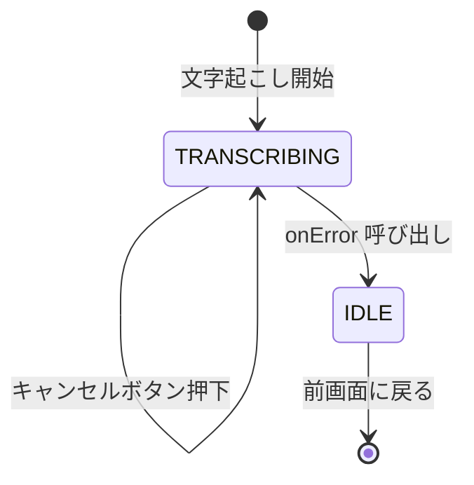

# v0.8.0 → v0.8.1 開発ログ

> 📂 パス: docs/_ログ/2026-07-04_v0.8.x開発ログ.md
> 📅 日付: 2026-07-03 〜 2026-07-04
> 👤 担当: ユーザー Hori
> 🔖 状態: v0.8.1 リリース済み (プッシュ済み)

---

## 概要

v0.7.x の UI/UX 改善リリース後、振幅感度・スレッド安定化・Whisper モデル設定反映を中心とした **v0.8.0** をリリース。さらに文字起こし画面のキャンセルボタン追加で **v0.8.1** として公開。

| バージョン | 主な変更 |
|---|---|
| v0.8.0 | 振幅感度300倍・スレッド4安定化・Whisperモデル設定反映・保存時のファイル名編集 |
| v0.8.1 | 文字起こし画面にキャンセルボタン追加 |

---

## v0.8.1 変更内容

### 追加機能

- **文字起こし画面のキャンセルボタン**
  - `TranscribingContent` の最下部に「キャンセル」ボタンを追加
  - 押下時は `onError` を呼び出して録音/処理フローを中断し、前の画面に戻る
  - 44dp 以上のタップ領域を確保 (Material Design 準拠)
  - エラー色で表示し、誤タップを防ぐため Outlined スタイルを採用

### 影響範囲

| ファイル | 変更内容 |
|---|---|
| `app/src/main/java/com/gijimemo/ui/processing/ProcessingScreen.kt` | `onCancel` パラメータ追加・キャンセルボタン UI 追加 |
| `app/build.gradle.kts` | versionCode: 34→35、versionName: 0.8.0→0.8.1 |

### 動作仕様

---

## 教訓

- キャンセル/戻る系のハンドラはコンポーネント側でも nullable にして柔軟に提供することで、将来の拡張（専用キャンセルロジック等）に備えられる
- 文字起こし処理は数十秒〜数分かかるため、ユーザーが中断できる導線を最初から UI に出しておくべき